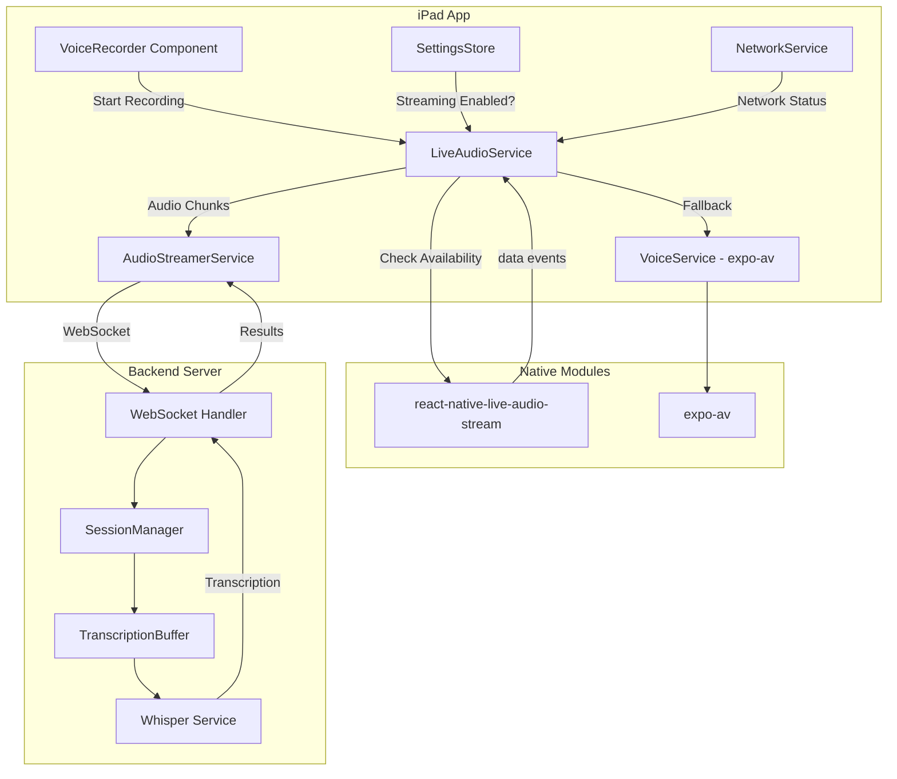
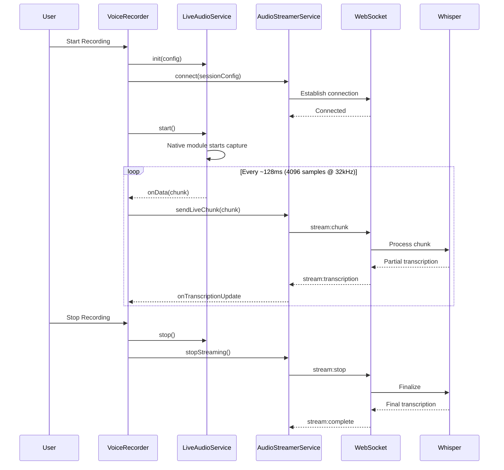
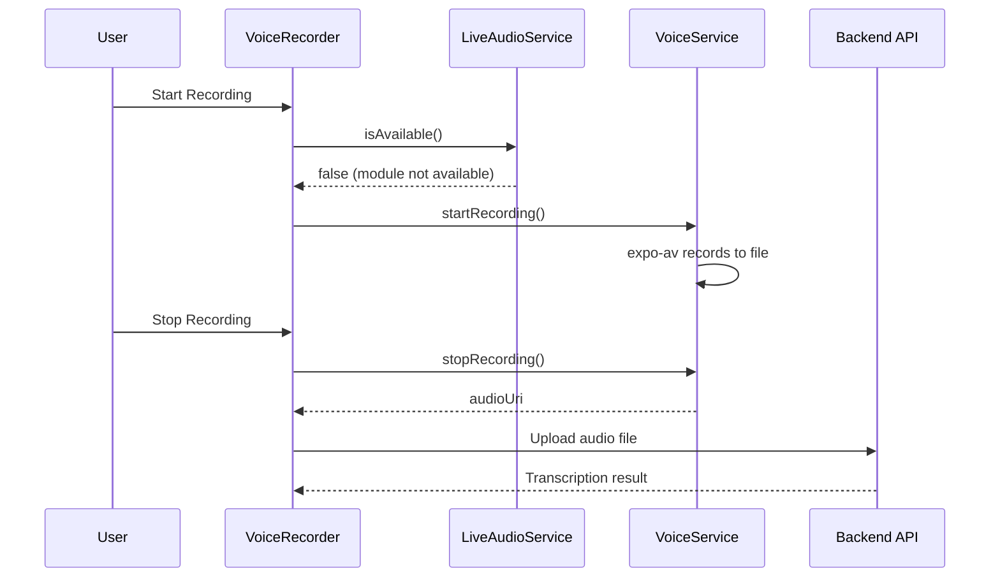

# Design Document - Live Audio Streaming Integration

## Overview

This design integrates `react-native-live-audio-stream` into VerbumCare to enable true real-time audio streaming. The library provides native audio capture with real-time data events, allowing audio to be streamed to the backend as it's captured rather than waiting for the recording to complete.

### Key Design Decisions

1. **Wrapper Service Pattern**: Create a `LiveAudioService` that wraps `react-native-live-audio-stream` and provides a consistent interface
2. **Graceful Degradation**: Automatically fall back to expo-av when the native module is unavailable
3. **Integration with Existing Infrastructure**: Reuse the existing `AudioStreamerService`, WebSocket handlers, and transcription services
4. **Configuration-Driven**: Audio settings optimized for voice recognition (32kHz, mono, 16-bit)
5. **Minimal Changes**: Keep changes focused on the audio capture layer, preserving existing streaming logic

## Architecture



## Components and Interfaces

### LiveAudioService

New service that wraps `react-native-live-audio-stream` and provides real-time audio capture.

```typescript
interface LiveAudioConfig {
  sampleRate: number;      // 32000 recommended for voice
  channels: number;        // 1 for mono
  bitsPerSample: number;   // 16 for adequate quality
  bufferSize: number;      // 4096 recommended
  audioSource?: number;    // Android only: 6 = VOICE_RECOGNITION
}

interface AudioDataEvent {
  data: string;            // Base64-encoded audio chunk
  timestamp: number;       // Capture timestamp
  sequenceNumber: number;  // For ordering
}

interface LiveAudioService {
  // Availability check
  isAvailable(): boolean;
  
  // Lifecycle
  init(config: LiveAudioConfig): void;
  start(): Promise<void>;
  stop(): Promise<void>;
  
  // Event handling
  onData(callback: (event: AudioDataEvent) => void): () => void;
  onError(callback: (error: Error) => void): () => void;
  
  // State
  isRecording(): boolean;
  getConfig(): LiveAudioConfig;
}

// Default configuration optimized for voice recognition
const DEFAULT_CONFIG: LiveAudioConfig = {
  sampleRate: 32000,
  channels: 1,
  bitsPerSample: 16,
  bufferSize: 4096,
  audioSource: 6,  // VOICE_RECOGNITION on Android
};
```

### Updated AudioStreamerService

Modifications to integrate with LiveAudioService.

```typescript
interface AudioStreamerService {
  // Existing methods remain unchanged
  connect(config: StreamingSessionConfig): Promise<StreamingSession>;
  disconnect(): void;
  startStreaming(): Promise<void>;
  stopStreaming(): Promise<StreamingResult>;
  
  // New method for live audio integration
  setAudioSource(source: 'live' | 'fallback'): void;
  
  // Modified to accept live audio chunks
  sendLiveChunk(event: AudioDataEvent): void;
}
```

### RecordingModeSelector

Logic for selecting between streaming and fallback modes.

```typescript
interface RecordingModeSelector {
  // Determine the best recording mode
  selectMode(context: RecordingContext): RecordingMode;
  
  // Check if live streaming is available
  canUseLiveStreaming(): boolean;
}

interface RecordingContext {
  streamingEnabled: boolean;    // User preference
  networkAvailable: boolean;    // Current network status
  liveAudioAvailable: boolean;  // Native module available
  backendSupportsStreaming: boolean;
}

type RecordingMode = 'live-streaming' | 'fallback-upload' | 'offline-queue';
```

## Data Models

### Audio Configuration

```typescript
// Stored in settings
interface StreamingSettings {
  enableStreaming: boolean;
  showProgressiveTranscript: boolean;
  audioConfig: {
    sampleRate: number;
    channels: number;
    bitsPerSample: number;
    bufferSize: number;
  };
}

// Default settings
const DEFAULT_STREAMING_SETTINGS: StreamingSettings = {
  enableStreaming: true,
  showProgressiveTranscript: true,
  audioConfig: {
    sampleRate: 32000,
    channels: 1,
    bitsPerSample: 16,
    bufferSize: 4096,
  },
};
```

### Chunk Transmission Format

```typescript
// Format sent over WebSocket
interface TransmittedChunk {
  sessionId: string;
  sequenceNumber: number;
  timestamp: number;
  data: ArrayBuffer;      // Decoded from base64
  format: {
    sampleRate: number;
    channels: number;
    bitsPerSample: number;
  };
}
```

## Sequence Diagrams

### Live Streaming Flow



### Fallback Mode Flow



## Error Handling

### Error Categories and Responses

| Error Type | Detection | Response |
|------------|-----------|----------|
| Module Not Available | `isAvailable()` returns false | Use fallback mode silently |
| Init Failed | Exception in `init()` | Use fallback mode, log error |
| Start Failed | Exception in `start()` | Use fallback mode, notify user |
| Capture Stopped | No data events for 5s | Attempt restart or fallback |
| Permission Denied | Permission check fails | Show permission guidance |
| Network Lost | NetworkService event | Buffer locally, queue for later |

### Error Recovery Strategy

```typescript
interface ErrorRecoveryStrategy {
  // Attempt to recover from error
  attemptRecovery(error: AudioError): RecoveryAction;
  
  // Preserve captured data
  preserveAudioData(chunks: AudioDataEvent[]): Promise<string>;
}

type RecoveryAction = 
  | { type: 'retry'; delay: number }
  | { type: 'fallback' }
  | { type: 'queue-offline' }
  | { type: 'notify-user'; message: string };
```

## Testing Strategy

### Unit Tests

- LiveAudioService: Initialization, start/stop lifecycle, event handling
- RecordingModeSelector: Mode selection logic for various contexts
- Chunk processing: Base64 decoding, sequence numbering, timestamp handling

### Property-Based Tests

Property-based tests will validate universal properties across all inputs using fast-check.

### Integration Tests

- End-to-end streaming with mock native module
- Fallback mode activation scenarios
- Error recovery flows

## Correctness Properties

*A property is a characteristic or behavior that should hold true across all valid executions of a system—essentially, a formal statement about what the system should do. Properties serve as the bridge between human-readable specifications and machine-verifiable correctness guarantees.*

### Property 1: Base64 Audio Data Round-Trip

*For any* audio chunk emitted by the native module, decoding the base64 data and re-encoding it SHALL produce the original base64 string. This ensures no data corruption during chunk processing.

**Validates: Requirements 1.3, 2.1**

### Property 2: Chunk Metadata Completeness

*For any* audio chunk transmitted to the backend, the chunk SHALL contain a valid sequence number (non-negative integer) and a valid timestamp (positive number representing milliseconds). Sequence numbers SHALL be strictly increasing within a session.

**Validates: Requirements 2.2, 2.3**

### Property 3: Stop Releases Resources

*For any* recording session, after `stop()` is called, no more data events SHALL be emitted and `isRecording()` SHALL return false within 1 second.

**Validates: Requirements 1.5**

### Property 4: Mode Selection Based on Settings

*For any* recording context where streaming is enabled in settings and the native module is available and network is available, the selected mode SHALL be 'live-streaming'. *For any* context where streaming is disabled, the selected mode SHALL be 'fallback-upload' or 'offline-queue'.

**Validates: Requirements 3.1, 3.4**

### Property 5: Network-Based Fallback

*For any* recording context where network is unavailable at recording start, the selected mode SHALL be 'offline-queue' regardless of other settings.

**Validates: Requirements 3.3**

### Property 6: Concurrent Recording Prevention

*For any* state where `isRecording()` returns true, attempting to call `start()` again SHALL either throw an error or return without starting a new recording. Only one recording SHALL be active at any time.

**Validates: Requirements 5.5**

### Property 7: Error Handling with Data Preservation

*For any* error that occurs during recording, the system SHALL: (1) log the error without showing it to the user, (2) preserve any audio data captured before the error, and (3) either recover or fall back gracefully.

**Validates: Requirements 5.4, 8.2, 8.4, 8.5**

### Property 8: Fallback Mode Equivalence

*For any* recording completed in fallback mode, the resulting audio file and transcription workflow SHALL be equivalent to the current expo-av implementation. The user experience SHALL be indistinguishable from the current app behavior.

**Validates: Requirements 10.2, 10.3**

## Native Build Configuration

### iOS Configuration

```xml
<!-- ios/VerbumCare/Info.plist -->
<key>NSMicrophoneUsageDescription</key>
<string>VerbumCare needs microphone access to record voice documentation for patient care.</string>
```

### Android Configuration

```xml
<!-- android/app/src/main/AndroidManifest.xml -->
<uses-permission android:name="android.permission.RECORD_AUDIO" />
```

### Package Installation

```bash
# Install the native module
npm install react-native-live-audio-stream

# iOS: Install pods
cd ios && pod install

# Rebuild the app
npx expo run:ios --device
```

## Migration Path

1. **Phase 1**: Add `react-native-live-audio-stream` dependency and create `LiveAudioService`
2. **Phase 2**: Integrate with `AudioStreamerService` for chunk transmission
3. **Phase 3**: Update `VoiceRecorder` component to use new service
4. **Phase 4**: Add mode selection logic and fallback handling
5. **Phase 5**: Native rebuild and testing on devices
