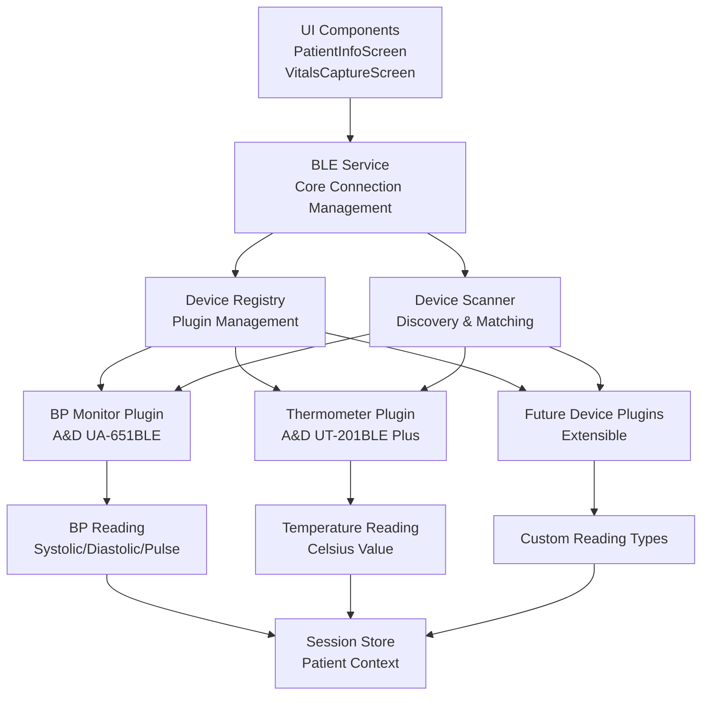
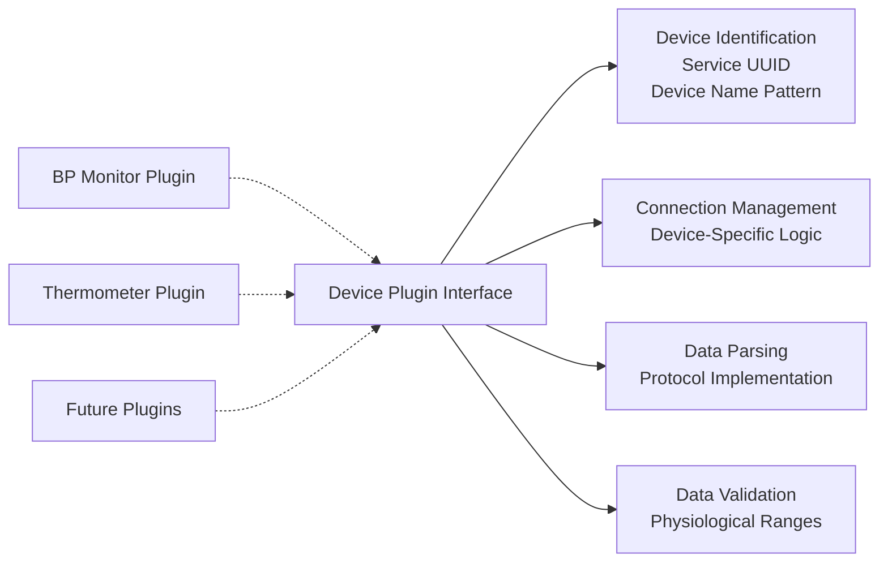

# Design Document

## Overview

This design implements a modular, plugin-based BLE device architecture for VerbumCare that transforms the current single-device system into an extensible multi-device platform. The architecture separates device-specific logic into plugins while maintaining a unified core BLE service for connection management, scanning, and data routing.

The design enables easy addition of new BLE medical devices without modifying core system code, starting with migrating the existing A&D UA-651BLE blood pressure monitor to a plugin and adding support for the A&D UT-201BLE Plus thermometer.

## Architecture

### High-Level Architecture



### Plugin Architecture



## Components and Interfaces

### Core BLE Service (Enhanced)

The existing BLE service is enhanced to support multiple device types through a plugin registry system:

```typescript
interface BLEService {
  // Existing methods (preserved for backward compatibility)
  setStatusCallback(callback: (status: BLEConnectionStatus) => void): void;
  onReading(callback: (reading: any) => void): () => void;
  requestPermissions(): Promise<boolean>;
  startScan(useTimeout?: boolean): Promise<void>;
  stopScan(): Promise<void>;
  disconnect(): Promise<void>;
  
  // New plugin management methods
  registerPlugin(plugin: DevicePlugin): void;
  getRegisteredPlugins(): DevicePlugin[];
  getPluginForDevice(device: Device): DevicePlugin | null;
}
```

### Device Plugin Interface

Standardized interface that all device plugins must implement:

```typescript
interface DevicePlugin {
  // Plugin metadata
  readonly pluginId: string;
  readonly deviceType: string;
  readonly supportedDevices: DeviceIdentifier[];
  
  // Device identification
  canHandleDevice(device: Device): Promise<boolean>;
  verifyDeviceIdentity(device: Device): Promise<boolean>;
  
  // Connection management
  connect(device: Device): Promise<void>;
  disconnect(device: Device): Promise<void>;
  
  // Data processing
  parseReading(characteristic: Characteristic): Promise<DeviceReading | null>;
  validateReading(reading: DeviceReading): boolean;
  
  // Error handling
  handleError(error: Error, context: string): void;
}

interface DeviceIdentifier {
  serviceUUID: string;
  characteristicUUID: string;
  deviceNamePattern: RegExp;
  manufacturerData?: string;
}

interface DeviceReading {
  type: string;
  timestamp: Date;
  deviceId: string;
  deviceModel: string;
  data: Record<string, any>;
  metadata?: Record<string, any>;
}
```

### Device Registry

Central registry for managing device plugins:

```typescript
interface DeviceRegistry {
  registerPlugin(plugin: DevicePlugin): void;
  unregisterPlugin(pluginId: string): void;
  getPlugin(pluginId: string): DevicePlugin | null;
  getPluginForDevice(device: Device): DevicePlugin | null;
  getAllPlugins(): DevicePlugin[];
  getPluginsByType(deviceType: string): DevicePlugin[];
}
```

### Enhanced Device Scanner

Updated scanner that works with the plugin system:

```typescript
interface DeviceScanner {
  startScan(plugins: DevicePlugin[]): Promise<void>;
  stopScan(): Promise<void>;
  onDeviceFound(callback: (device: Device, plugin: DevicePlugin) => void): () => void;
}
```

## Data Models

### Enhanced BLE Types

Extended type definitions to support multiple device types:

```typescript
// Enhanced reading types
interface BPReading extends DeviceReading {
  type: 'blood_pressure';
  data: {
    systolic: number;
    diastolic: number;
    pulse: number;
  };
}

interface TemperatureReading extends DeviceReading {
  type: 'temperature';
  data: {
    temperature_celsius: number;
    unit: 'celsius' | 'fahrenheit';
    precision: number;
  };
}

// Enhanced pairing data
interface PairedDevice {
  id: string;
  name: string | null;
  deviceType: string;
  pluginId: string;
  serviceUUID: string;
  pairedAt: string;
  lastConnectedAt: string;
  metadata?: Record<string, any>;
}

// Plugin registration data
interface PluginRegistration {
  pluginId: string;
  deviceType: string;
  version: string;
  registeredAt: string;
  isActive: boolean;
}
```

## Plugin Implementations

### Blood Pressure Monitor Plugin

Migrates existing BP monitor logic into a plugin:

```typescript
class BPMonitorPlugin implements DevicePlugin {
  readonly pluginId = 'ad-bp-monitor';
  readonly deviceType = 'blood_pressure_monitor';
  readonly supportedDevices = [{
    serviceUUID: '00001810-0000-1000-8000-00805F9B34FB',
    characteristicUUID: '00002A35-0000-1000-8000-00805F9B34FB',
    deviceNamePattern: /UA-651/i
  }];

  async canHandleDevice(device: Device): Promise<boolean> {
    return device.name?.toUpperCase().includes('UA-651') || false;
  }

  async verifyDeviceIdentity(device: Device): Promise<boolean> {
    // Existing verification logic from current BLE service
    const connectedDevice = await device.connect();
    const services = await connectedDevice.services();
    return services.some(service => 
      service.uuid.toUpperCase() === this.supportedDevices[0].serviceUUID.toUpperCase()
    );
  }

  async parseReading(characteristic: Characteristic): Promise<BPReading | null> {
    // Existing BP parsing logic from current implementation
    const reading = this.parseBPData(characteristic);
    if (!reading) return null;
    
    return {
      type: 'blood_pressure',
      timestamp: new Date(),
      deviceId: characteristic.deviceID,
      deviceModel: 'A&D UA-651BLE',
      data: {
        systolic: reading.systolic,
        diastolic: reading.diastolic,
        pulse: reading.pulse
      }
    };
  }

  validateReading(reading: BPReading): boolean {
    const { systolic, diastolic, pulse } = reading.data;
    return systolic > 50 && systolic < 300 &&
           diastolic > 30 && diastolic < 200 &&
           pulse > 30 && pulse < 250;
  }

  private parseBPData(characteristic: Characteristic): any {
    // Existing IEEE 11073 SFLOAT parsing logic
    // (Preserved from current implementation)
  }
}
```

### Thermometer Plugin

New plugin for A&D UT-201BLE Plus thermometer:

```typescript
class ThermometerPlugin implements DevicePlugin {
  readonly pluginId = 'ad-thermometer';
  readonly deviceType = 'thermometer';
  readonly supportedDevices = [{
    serviceUUID: '00001809-0000-1000-8000-00805F9B34FB', // Health Thermometer Service
    characteristicUUID: '00002A1C-0000-1000-8000-00805F9B34FB', // Temperature Measurement
    deviceNamePattern: /UT-201/i
  }];

  async canHandleDevice(device: Device): Promise<boolean> {
    return device.name?.toUpperCase().includes('UT-201') || false;
  }

  async verifyDeviceIdentity(device: Device): Promise<boolean> {
    const connectedDevice = await device.connect();
    const services = await connectedDevice.services();
    return services.some(service => 
      service.uuid.toUpperCase() === this.supportedDevices[0].serviceUUID.toUpperCase()
    );
  }

  async parseReading(characteristic: Characteristic): Promise<TemperatureReading | null> {
    const tempData = this.parseTemperatureData(characteristic);
    if (!tempData) return null;
    
    return {
      type: 'temperature',
      timestamp: new Date(),
      deviceId: characteristic.deviceID,
      deviceModel: 'A&D UT-201BLE Plus',
      data: {
        temperature_celsius: tempData.temperature,
        unit: 'celsius',
        precision: 0.1
      }
    };
  }

  validateReading(reading: TemperatureReading): boolean {
    const temp = reading.data.temperature_celsius;
    return temp >= 30.0 && temp <= 45.0;
  }

  private parseTemperatureData(characteristic: Characteristic): { temperature: number } | null {
    try {
      const base64 = characteristic.value;
      if (!base64) return null;

      // Decode base64 to bytes
      const binaryString = atob(base64);
      const bytes = new Uint8Array(binaryString.length);
      for (let i = 0; i < binaryString.length; i++) {
        bytes[i] = binaryString.charCodeAt(i);
      }

      // Health Thermometer Measurement format (GATT Specification)
      // Byte 0: Flags
      //   Bit 0: Temperature units (0=Celsius, 1=Fahrenheit)
      //   Bit 1: Time stamp present
      //   Bit 2: Temperature type present
      // Bytes 1-4: Temperature (IEEE 11073 FLOAT, little-endian)
      
      const flags = bytes[0];
      const isFahrenheit = (flags & 0x01) !== 0;
      
      // Parse IEEE 11073 FLOAT (32-bit) or SFLOAT (16-bit)
      let temperature: number;
      
      if (bytes.length >= 5) {
        // 32-bit FLOAT format
        temperature = this.parseFloat32(bytes[1], bytes[2], bytes[3], bytes[4]);
      } else if (bytes.length >= 3) {
        // 16-bit SFLOAT format
        temperature = this.parseSFloat16(bytes[1], bytes[2]);
      } else {
        return null;
      }

      // Convert to Celsius if needed
      if (isFahrenheit) {
        temperature = (temperature - 32) * 5 / 9;
      }

      // Round to 0.1°C precision
      temperature = Math.round(temperature * 10) / 10;

      return { temperature };
    } catch (error) {
      console.error('[Thermometer] Parse error:', error);
      return null;
    }
  }

  private parseSFloat16(byte1: number, byte2: number): number {
    // IEEE 11073 SFLOAT: 4-bit exponent, 12-bit mantissa
    const value = byte1 | (byte2 << 8);
    const mantissa = value & 0x0FFF;
    const exponent = (value >> 12) & 0x0F;
    
    // Handle signed mantissa (12-bit two's complement)
    const signedMantissa = mantissa & 0x0800 ? mantissa | 0xFFFFF000 : mantissa;
    
    return signedMantissa * Math.pow(10, exponent);
  }

  private parseFloat32(byte1: number, byte2: number, byte3: number, byte4: number): number {
    // IEEE 11073 FLOAT: 8-bit exponent, 24-bit mantissa
    const value = byte1 | (byte2 << 8) | (byte3 << 16) | (byte4 << 24);
    const mantissa = value & 0x00FFFFFF;
    const exponent = (value >> 24) & 0xFF;
    
    // Handle signed mantissa (24-bit two's complement)
    const signedMantissa = mantissa & 0x00800000 ? mantissa | 0xFF000000 : mantissa;
    
    return signedMantissa * Math.pow(10, exponent);
  }
}
```

## Integration Points

### UI Component Integration

Enhanced UI components to handle multiple device types:

```typescript
// Enhanced VitalsCaptureScreen integration
const handleDeviceReading = (reading: DeviceReading) => {
  switch (reading.type) {
    case 'blood_pressure':
      const bpReading = reading as BPReading;
      setSystolic(bpReading.data.systolic.toString());
      setDiastolic(bpReading.data.diastolic.toString());
      setPulse(bpReading.data.pulse.toString());
      break;
      
    case 'temperature':
      const tempReading = reading as TemperatureReading;
      setTemperature(tempReading.data.temperature_celsius.toString());
      break;
      
    default:
      console.warn('Unknown reading type:', reading.type);
  }
};

// Enhanced PatientInfoScreen integration
const handleDeviceReading = async (reading: DeviceReading) => {
  try {
    let vitalsData: any = {
      measured_at: reading.timestamp,
    };

    switch (reading.type) {
      case 'blood_pressure':
        const bpReading = reading as BPReading;
        vitalsData = {
          ...vitalsData,
          blood_pressure_systolic: bpReading.data.systolic,
          blood_pressure_diastolic: bpReading.data.diastolic,
          heart_rate: bpReading.data.pulse,
        };
        break;
        
      case 'temperature':
        const tempReading = reading as TemperatureReading;
        vitalsData = {
          ...vitalsData,
          temperature_celsius: tempReading.data.temperature_celsius,
        };
        break;
    }

    setVitals(vitalsData);
    
    // Persist to backend
    if (currentPatient) {
      await api.recordVitals({
        patient_id: currentPatient.patient_id,
        ...vitalsData,
        input_method: 'iot_sensor',
        recorded_by: currentUser?.userId || DEMO_STAFF_ID,
      });
    }
  } catch (error) {
    console.error('Error handling device reading:', error);
  }
};
```

### Session Store Integration

Enhanced session store to handle multiple reading types:

```typescript
// Enhanced vitals data structure
interface SessionVitals {
  // Existing fields
  blood_pressure_systolic?: number;
  blood_pressure_diastolic?: number;
  heart_rate?: number;
  
  // New temperature field
  temperature_celsius?: number;
  
  // Metadata
  measured_at?: Date;
  _savedToBackend?: boolean;
  _backendVitalId?: string;
  _deviceReadings?: DeviceReading[]; // Track source readings
}
```

## Error Handling

### Plugin Error Handling

Standardized error handling across all plugins:

```typescript
interface PluginError extends Error {
  pluginId: string;
  deviceId?: string;
  context: string;
  recoverable: boolean;
}

class PluginErrorHandler {
  static handleError(error: PluginError): void {
    console.error(`[Plugin:${error.pluginId}] ${error.context}:`, error.message);
    
    if (error.recoverable) {
      // Attempt recovery (restart scan, reconnect, etc.)
      this.attemptRecovery(error);
    } else {
      // Log critical error and disable plugin
      this.disablePlugin(error.pluginId);
    }
  }
  
  private static attemptRecovery(error: PluginError): void {
    // Implementation for recovery strategies
  }
  
  private static disablePlugin(pluginId: string): void {
    // Implementation for plugin disabling
  }
}
```

### Connection Resilience

Enhanced connection management with plugin-aware error handling:

```typescript
class ConnectionManager {
  private activeConnections = new Map<string, { device: Device; plugin: DevicePlugin }>();
  
  async handleConnectionError(deviceId: string, error: Error): Promise<void> {
    const connection = this.activeConnections.get(deviceId);
    if (!connection) return;
    
    try {
      // Let plugin handle device-specific error recovery
      connection.plugin.handleError(error, 'connection');
      
      // Clean up connection
      await connection.device.cancelConnection();
      this.activeConnections.delete(deviceId);
      
      // Resume scanning for all device types
      await this.resumeScanning();
    } catch (recoveryError) {
      console.error('Error during connection recovery:', recoveryError);
    }
  }
  
  private async resumeScanning(): Promise<void> {
    // Restart scanning for all registered plugins
    const plugins = deviceRegistry.getAllPlugins();
    await deviceScanner.startScan(plugins);
  }
}
```

## Testing Strategy

### Unit Testing

**Plugin Testing**:
- Test each plugin's device identification logic
- Test data parsing with known device data samples
- Test validation logic with edge cases
- Test error handling scenarios

**Registry Testing**:
- Test plugin registration and discovery
- Test device-to-plugin matching logic
- Test plugin lifecycle management

**Integration Testing**:
- Test multi-device scenarios
- Test plugin interaction with core BLE service
- Test UI integration with different reading types

### Property-Based Testing

Property-based tests will be implemented to validate the plugin architecture and device handling logic. Before writing the correctness properties, I need to analyze the acceptance criteria for testability.

## Correctness Properties

*A property is a characteristic or behavior that should hold true across all valid executions of a system-essentially, a formal statement about what the system should do. Properties serve as the bridge between human-readable specifications and machine-verifiable correctness guarantees.*

### Property Reflection

After analyzing all acceptance criteria, several properties can be consolidated to eliminate redundancy:

- Plugin interface compliance properties (2.1-2.5) can be combined into comprehensive plugin validation
- Device identification properties (3.2, 4.1) can be generalized to plugin-specific device matching
- Data parsing properties (3.3, 4.3) can be unified under plugin-specific parsing validation
- Validation range properties (3.4, 4.4, 10.1) can be combined into device-specific validation
- Backward compatibility properties (11.1, 11.3, 11.5) can be consolidated into BP plugin compatibility

### Core Properties

**Property 1: Plugin Interface Compliance**
*For any* device plugin implementation, all required interface methods (canHandleDevice, verifyDeviceIdentity, connect, disconnect, parseReading, validateReading, handleError) should be implemented and return values of the correct types
**Validates: Requirements 2.1, 2.2, 2.3, 2.4**

**Property 2: Plugin Registration and Discovery**
*For any* set of available device plugins, the device registry should automatically discover and register all plugins that implement the correct interface
**Validates: Requirements 1.2, 12.2**

**Property 3: Device-to-Plugin Matching**
*For any* BLE device with known service UUID and device name, the device detector should match it to the plugin with the most specific matching criteria
**Validates: Requirements 1.3, 1.5**

**Property 4: Plugin Extensibility**
*For any* new device plugin that implements the standardized interface, it should be usable without modifying existing core BLE service code
**Validates: Requirements 1.1, 12.1**

**Property 5: Multi-Device Session Management**
*For any* combination of registered device plugins, the BLE service should be able to scan for, connect to, and process readings from multiple device types concurrently
**Validates: Requirements 5.1, 5.2, 5.3**

**Property 6: Device-Specific Data Validation**
*For any* device reading parsed by a plugin, the reading should be validated according to that plugin's device-specific physiological ranges and data quality rules
**Validates: Requirements 2.5, 10.1, 10.2**

**Property 7: Reading Type Routing**
*For any* device reading received, the system should route it to the appropriate UI component based on the reading's type field
**Validates: Requirements 5.4, 7.1**

**Property 8: Patient Context Association**
*For any* device reading received in a patient context, the reading should be automatically associated with the current patient and saved to the session store
**Validates: Requirements 6.1, 6.2**

**Property 9: Backend Persistence with Offline Resilience**
*For any* device reading saved to session, the system should attempt immediate backend persistence and retain the reading locally if persistence fails
**Validates: Requirements 6.3, 6.4, 6.5**

**Property 10: Device Pairing Management**
*For any* device that connects successfully for the first time, it should be added to the paired devices list with correct device type metadata, and subsequent connections should skip identity verification
**Validates: Requirements 8.1, 8.2**

**Property 11: Error Isolation**
*For any* plugin that encounters a connection or parsing error, the error should not affect the operation of other plugins or the core BLE service
**Validates: Requirements 9.1, 9.2**

**Property 12: BP Monitor Backward Compatibility**
*For any* BP monitor usage scenario, the system with the BP monitor plugin should produce identical results to the current implementation
**Validates: Requirements 3.1, 3.5, 11.1, 11.3**

**Property 13: Data Migration Consistency**
*For any* existing BP monitor pairing data, the system should migrate it to the new plugin-based format while preserving all functionality
**Validates: Requirements 11.2**

**Property 14: Manual Override Precedence**
*For any* vital sign field where the user provides manual input, the system should disable BLE auto-population for that field type and respect the manual entry
**Validates: Requirements 7.5**

**Property 15: Physiological Range Validation**
*For any* device reading that falls outside normal physiological ranges, the system should flag it as potentially invalid but still display it with appropriate warnings
**Validates: Requirements 10.2, 7.4**

**Property 16: Sentinel Value Rejection**
*For any* device reading containing sentinel values (such as 2047 in IEEE 11073 SFLOAT format), the plugin should reject the reading as invalid
**Validates: Requirements 10.3**

**Property 17: Precision Preservation**
*For any* device reading with available precision information, the plugin should preserve the appropriate decimal precision for that measurement type
**Validates: Requirements 10.4**

**Property 18: Connection Resilience**
*For any* device that disconnects unexpectedly, the BLE service should clean up the connection and restart scanning for all registered device types
**Validates: Requirements 9.3**

**Property 19: Exponential Backoff**
*For any* device type that experiences multiple consecutive connection failures, the BLE service should implement exponential backoff to prevent resource exhaustion
**Validates: Requirements 9.5**

**Property 20: Custom Reading Type Support**
*For any* plugin that defines custom reading data structures, the core system should handle them while maintaining compatibility with existing reading types
**Validates: Requirements 12.3**

## Testing Strategy

### Dual Testing Approach

The system will use both unit tests and property-based tests to ensure comprehensive coverage:

**Unit Tests**: Focus on specific examples, edge cases, and integration points
- Plugin interface implementation verification
- Device identification with known device samples
- Data parsing with sample BLE characteristic data
- UI integration with mock readings
- Error handling scenarios

**Property-Based Tests**: Verify universal properties across all inputs
- Plugin compliance across randomly generated plugin implementations
- Device matching with generated device configurations
- Data validation with random measurement values
- Multi-device scenarios with various plugin combinations
- Error resilience with simulated failure conditions

### Property-Based Testing Configuration

- **Testing Library**: fast-check (React Native/TypeScript compatible)
- **Test Iterations**: Minimum 100 iterations per property test
- **Test Tags**: Each property test will reference its design document property
  - Format: **Feature: multi-device-ble-support, Property {number}: {property_text}**
- **Coverage**: Each correctness property will be implemented by a single property-based test

### Testing Priorities

1. **Plugin Architecture**: Verify the plugin system works correctly with various plugin implementations
2. **Device Compatibility**: Ensure existing BP monitor functionality is preserved
3. **Multi-Device Support**: Test concurrent operation of multiple device types
4. **Data Integrity**: Verify readings are parsed, validated, and stored correctly
5. **Error Resilience**: Test system behavior under various failure conditions
6. **UI Integration**: Verify readings are properly routed to UI components
7. **Backward Compatibility**: Ensure existing workflows continue unchanged