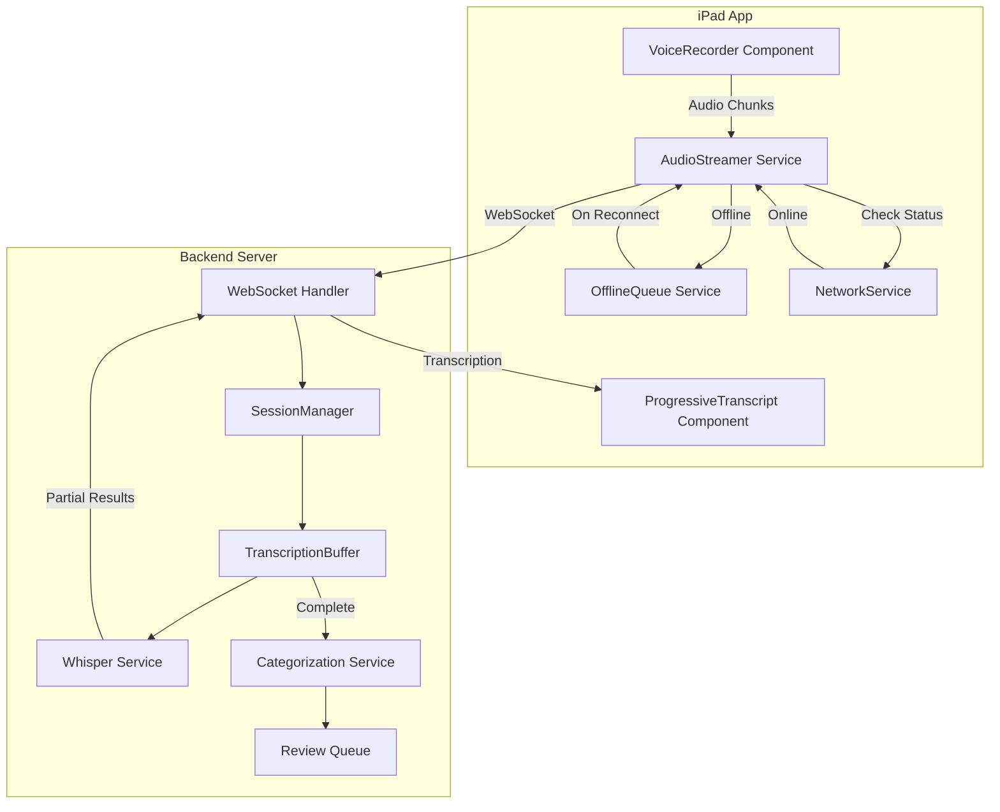
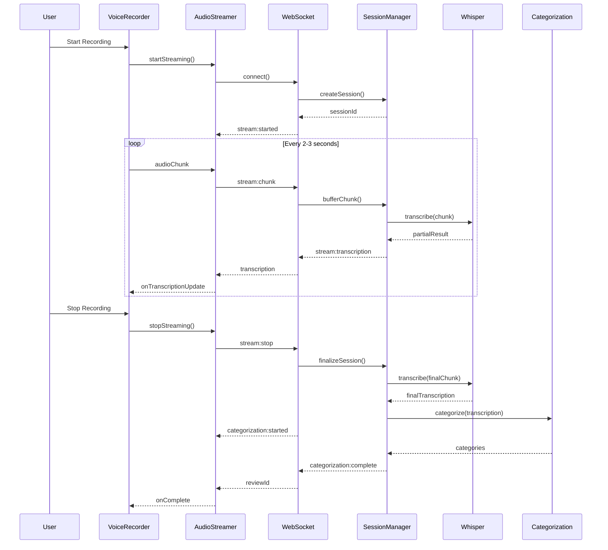
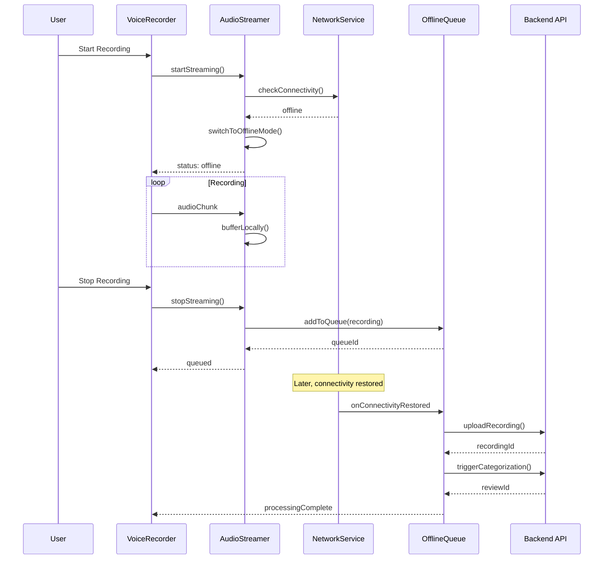

# Design Document - Streaming Voice Transcription

## Overview

This design implements real-time audio streaming with progressive transcription for VerbumCare's voice documentation workflow. The system uses WebSocket connections for bidirectional communication, enabling audio chunks to be transmitted as they're recorded and transcription results to be displayed progressively. The design prioritizes offline-first operation, ensuring nurses can document care regardless of network conditions.

### Key Design Decisions

1. **WebSocket over HTTP Polling**: WebSocket provides lower latency and bidirectional communication essential for real-time transcription feedback
2. **Chunked Audio Processing**: 2-3 second audio chunks balance transcription quality with responsiveness
3. **Offline-First Architecture**: Local recording and queuing ensures no data loss during network issues
4. **Graceful Degradation**: Automatic fallback to existing upload workflow when streaming unavailable
5. **Socket.IO Integration**: Leverages existing Socket.IO infrastructure for WebSocket management

## Architecture



## Components and Interfaces

### Client-Side Components

#### AudioStreamerService

Manages real-time audio capture and transmission with offline fallback.

```typescript
interface AudioStreamerService {
  // Connection management
  connect(sessionConfig: StreamingSessionConfig): Promise<StreamingSession>;
  disconnect(): void;
  
  // Streaming control
  startStreaming(): Promise<void>;
  pauseStreaming(): void;
  resumeStreaming(): void;
  stopStreaming(): Promise<StreamingResult>;
  
  // Event handlers
  onTranscriptionUpdate: (callback: (text: string, confidence: number) => void) => void;
  onConnectionStatusChange: (callback: (status: ConnectionStatus) => void) => void;
  onError: (callback: (error: StreamingError) => void) => void;
  
  // State
  getConnectionStatus(): ConnectionStatus;
  isStreaming(): boolean;
  getBufferedDuration(): number;
}

interface StreamingSessionConfig {
  patientId?: string;
  contextType: 'patient' | 'global';
  language: 'ja' | 'en' | 'zh-TW';
  userId: string;
}

interface StreamingSession {
  sessionId: string;
  startedAt: Date;
  status: 'connected' | 'streaming' | 'buffering' | 'offline';
}

type ConnectionStatus = 'connected' | 'connecting' | 'disconnected' | 'offline';
```

#### OfflineQueueService

Manages local storage and processing of offline recordings.

```typescript
interface OfflineQueueService {
  // Queue management
  addToQueue(recording: OfflineRecording): Promise<string>;
  getQueue(): Promise<OfflineRecording[]>;
  removeFromQueue(recordingId: string): Promise<void>;
  
  // Processing
  processQueue(): Promise<ProcessingResult[]>;
  processRecording(recordingId: string): Promise<ProcessingResult>;
  
  // Status
  getPendingCount(): Promise<number>;
  getOldestPendingAge(): Promise<number | null>;
  
  // Events
  onQueueChange: (callback: (queue: OfflineRecording[]) => void) => void;
  onProcessingComplete: (callback: (result: ProcessingResult) => void) => void;
}

interface OfflineRecording {
  id: string;
  audioUri: string;
  duration: number;
  recordedAt: Date;
  patientId?: string;
  contextType: 'patient' | 'global';
  language: string;
  userId: string;
  status: 'pending' | 'processing' | 'failed' | 'completed';
  retryCount: number;
  lastError?: string;
}
```

#### ProgressiveTranscriptComponent

Displays real-time transcription with confidence indicators.

```typescript
interface ProgressiveTranscriptProps {
  // Transcription data
  segments: TranscriptSegment[];
  isStreaming: boolean;
  
  // Display options
  showConfidence: boolean;
  autoScroll: boolean;
  
  // Callbacks
  onSegmentEdit?: (segmentId: string, newText: string) => void;
}

interface TranscriptSegment {
  id: string;
  text: string;
  confidence: number;
  timestamp: number;
  isFinal: boolean;
}
```

### Server-Side Components

#### StreamingSessionManager

Manages active streaming sessions and resource allocation.

```typescript
interface StreamingSessionManager {
  // Session lifecycle
  createSession(config: SessionConfig): Promise<Session>;
  getSession(sessionId: string): Session | null;
  closeSession(sessionId: string): Promise<void>;
  
  // Resource management
  getActiveSessionCount(): number;
  canAcceptNewSession(): boolean;
  
  // Cleanup
  cleanupIdleSessions(): Promise<number>;
  cleanupAllSessions(): Promise<void>;
}

interface Session {
  sessionId: string;
  userId: string;
  patientId?: string;
  contextType: 'patient' | 'global';
  language: string;
  createdAt: Date;
  lastActivityAt: Date;
  transcriptionBuffer: string;
  audioChunks: AudioChunk[];
  status: 'active' | 'idle' | 'processing' | 'completed';
}

interface AudioChunk {
  sequenceNumber: number;
  data: Buffer;
  receivedAt: Date;
  processed: boolean;
}
```

#### WebSocket Event Handlers

Socket.IO events for streaming communication.

```typescript
// Client -> Server Events
interface ClientToServerEvents {
  'stream:start': (config: StreamingSessionConfig) => void;
  'stream:chunk': (chunk: { sequenceNumber: number; data: ArrayBuffer }) => void;
  'stream:pause': () => void;
  'stream:resume': () => void;
  'stream:stop': () => void;
  'stream:cancel': () => void;
}

// Server -> Client Events
interface ServerToClientEvents {
  'stream:started': (session: { sessionId: string }) => void;
  'stream:transcription': (data: { text: string; confidence: number; isFinal: boolean }) => void;
  'stream:error': (error: { code: string; message: string }) => void;
  'stream:complete': (result: { transcription: string; sessionId: string }) => void;
  'categorization:started': () => void;
  'categorization:complete': (data: { reviewId: string; categories: string[] }) => void;
  'categorization:error': (error: { code: string; message: string }) => void;
}
```

## Data Models

### Database Schema Extensions

```sql
-- Add streaming-related columns to voice_recordings
ALTER TABLE voice_recordings ADD COLUMN IF NOT EXISTS
  streaming_session_id UUID,
  is_streamed BOOLEAN DEFAULT FALSE,
  chunk_count INTEGER DEFAULT 0,
  streaming_started_at TIMESTAMP,
  streaming_completed_at TIMESTAMP;

-- Streaming sessions table for tracking active sessions
CREATE TABLE IF NOT EXISTS streaming_sessions (
  session_id UUID PRIMARY KEY DEFAULT gen_random_uuid(),
  user_id UUID NOT NULL REFERENCES users(user_id),
  patient_id UUID REFERENCES patients(patient_id),
  context_type VARCHAR(20) NOT NULL DEFAULT 'global',
  language VARCHAR(10) NOT NULL DEFAULT 'ja',
  status VARCHAR(20) NOT NULL DEFAULT 'active',
  transcription_buffer TEXT,
  chunk_count INTEGER DEFAULT 0,
  created_at TIMESTAMP DEFAULT NOW(),
  last_activity_at TIMESTAMP DEFAULT NOW(),
  completed_at TIMESTAMP,
  error_message TEXT
);

-- Index for cleanup queries
CREATE INDEX IF NOT EXISTS idx_streaming_sessions_status 
  ON streaming_sessions(status, last_activity_at);
```

### Client-Side Storage Schema (AsyncStorage)

```typescript
// Offline queue storage key: '@verbumcare/offline_recordings'
interface OfflineQueueStorage {
  recordings: OfflineRecording[];
  lastProcessedAt: string | null;
  version: number;
}

// Streaming preferences key: '@verbumcare/streaming_preferences'
interface StreamingPreferences {
  enabled: boolean;
  showProgressiveTranscript: boolean;
  autoCategorizationEnabled: boolean;
}
```


## Sequence Diagrams

### Online Streaming Flow



### Offline Recording Flow



## Error Handling

### Error Categories and Responses

| Error Type | Client Response | Server Response |
|------------|-----------------|-----------------|
| Connection Failed | Switch to offline mode silently | N/A |
| Chunk Transmission Failed | Buffer locally, retry on reconnect | Log error, preserve session |
| Transcription Failed | Display partial results, allow retry | Return error code, preserve audio |
| Categorization Failed | Show transcription, offer retry button | Queue for manual processing |
| Session Timeout | Auto-reconnect or switch to offline | Cleanup resources, preserve data |
| Resource Exhaustion | Queue session, notify user | Reject new sessions, prioritize active |

### Error Codes

```typescript
enum StreamingErrorCode {
  CONNECTION_FAILED = 'STREAM_001',
  SESSION_LIMIT_REACHED = 'STREAM_002',
  CHUNK_TRANSMISSION_FAILED = 'STREAM_003',
  TRANSCRIPTION_FAILED = 'STREAM_004',
  CATEGORIZATION_FAILED = 'STREAM_005',
  SESSION_TIMEOUT = 'STREAM_006',
  INVALID_AUDIO_FORMAT = 'STREAM_007',
  AUDIO_QUALITY_INSUFFICIENT = 'STREAM_008',
  RESOURCE_EXHAUSTED = 'STREAM_009',
  SESSION_NOT_FOUND = 'STREAM_010',
}
```

## Testing Strategy

### Unit Tests

- AudioStreamerService: Connection management, chunk buffering, state transitions
- OfflineQueueService: Queue operations, persistence, retry logic
- SessionManager: Session lifecycle, resource limits, cleanup
- TranscriptionBuffer: Chunk ordering, partial result assembly

### Property-Based Tests

Property-based tests will validate universal properties across all inputs using fast-check.

### Integration Tests

- End-to-end streaming flow with mock Whisper service
- Offline queue processing with simulated network conditions
- WebSocket reconnection scenarios
- Concurrent session handling


## Correctness Properties

*A property is a characteristic or behavior that should hold true across all valid executions of a system—essentially, a formal statement about what the system should do. Properties serve as the bridge between human-readable specifications and machine-verifiable correctness guarantees.*

### Property 1: Chunk Transmission Timing

*For any* recording session with duration > 3 seconds, the time between consecutive chunk transmissions SHALL be between 2 and 3 seconds (±500ms tolerance for processing overhead).

**Validates: Requirements 1.2**

### Property 2: Chunk Ordering Preservation

*For any* sequence of audio chunks received by the server, regardless of network delays or out-of-order arrival, the transcription buffer SHALL contain chunks ordered by their sequence numbers, and the final transcription SHALL reflect the correct temporal order of speech.

**Validates: Requirements 1.3, 6.5**

### Property 3: Recording State Transitions

*For any* recording session, the state machine SHALL follow valid transitions only: `idle → streaming → paused → streaming → stopped` or `idle → streaming → stopped`. Pausing SHALL halt chunk transmission, and resuming SHALL continue from the exact point where pausing occurred with no audio loss.

**Validates: Requirements 1.5, 1.6**

### Property 4: Confidence-Based Segment Marking

*For any* transcription segment with confidence score < 0.7, the segment SHALL be marked with `isUncertain: true`. *For any* segment with confidence ≥ 0.7, the segment SHALL have `isUncertain: false`.

**Validates: Requirements 2.3**

### Property 5: Data Preservation on Errors

*For any* error occurring during streaming, transcription, or categorization, all previously captured audio and transcription data SHALL be preserved. The length of preserved transcription after an error SHALL be ≥ the length before the error.

**Validates: Requirements 2.5, 2.6, 3.4, 3.5, 4.3**

### Property 6: Session Identifier Uniqueness

*For any* set of streaming sessions created within a 24-hour period, all session identifiers SHALL be unique. No two sessions SHALL share the same sessionId.

**Validates: Requirements 4.1**

### Property 7: Concurrent Session Limits

*For any* system state where active session count equals the configured maximum, new session requests SHALL be queued rather than rejected. The queue SHALL process sessions in FIFO order when capacity becomes available.

**Validates: Requirements 4.4, 4.5**

### Property 8: Network Resilience Round-Trip

*For any* recording that experiences network disconnection and reconnection, the final transcription SHALL be equivalent to a recording made with continuous connectivity. Buffered chunks SHALL be transmitted in sequence order upon reconnection.

**Validates: Requirements 5.2, 5.3, 5.4, 5.5, 5.7**

### Property 9: Silent Error Handling

*For any* network error (connection failure, timeout, transmission error), the system SHALL NOT produce user-visible error dialogs or messages. The error state SHALL be reflected only in status indicators.

**Validates: Requirements 5.10**

### Property 10: Audio Format Validity

*For any* audio chunk created by the AudioStreamer, the chunk SHALL be in a valid WAV or M4A format that can be decoded by the Whisper service. Invalid format chunks SHALL be rejected with specific error feedback.

**Validates: Requirements 6.1, 6.3**

### Property 11: Context Immutability

*For any* streaming session, the context (patientId, contextType) established at session start SHALL remain unchanged throughout the entire session lifecycle including transcription and categorization. Context mutations SHALL be rejected.

**Validates: Requirements 8.1, 8.2, 8.3**

### Property 12: Non-Blocking Processing

*For any* active Whisper transcription operation, concurrent API requests to other endpoints SHALL complete within their normal response times (±10% variance). Transcription SHALL NOT block the event loop.

**Validates: Requirements 9.2, 9.5**

### Property 13: Offline Queue Metadata Completeness

*For any* recording added to the offline queue, the stored record SHALL contain all required metadata: id, audioUri, duration, recordedAt, contextType, language, userId, status, and retryCount.

**Validates: Requirements 10.1**

### Property 14: Offline Queue Processing Order

*For any* offline queue with multiple pending items, processing SHALL occur in chronological order (oldest recordedAt first). An item with earlier recordedAt SHALL be processed before an item with later recordedAt.

**Validates: Requirements 10.3**

### Property 15: Retry Limit Enforcement

*For any* offline recording that fails processing, the system SHALL retry up to 3 times. After 3 failed attempts, the recording status SHALL be set to 'failed' and SHALL NOT be automatically retried.

**Validates: Requirements 10.5**

### Property 16: Age-Based Urgency Flagging

*For any* offline queue item where (currentTime - recordedAt) > 24 hours, the item SHALL be flagged as `isUrgent: true`. Items younger than 24 hours SHALL have `isUrgent: false`.

**Validates: Requirements 10.6**

