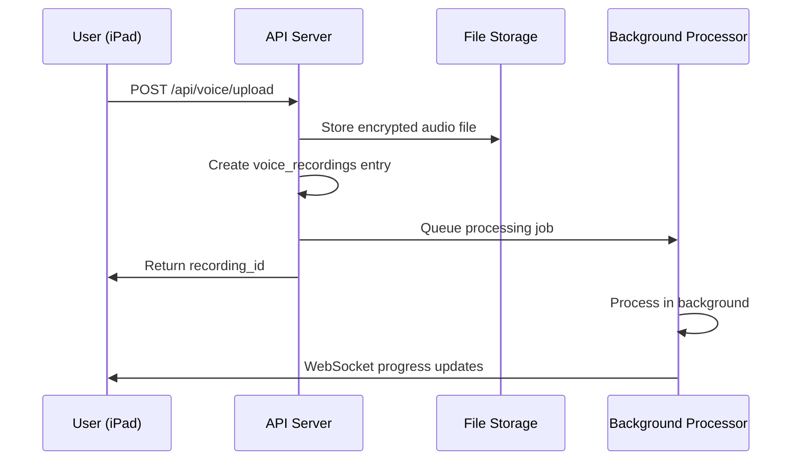
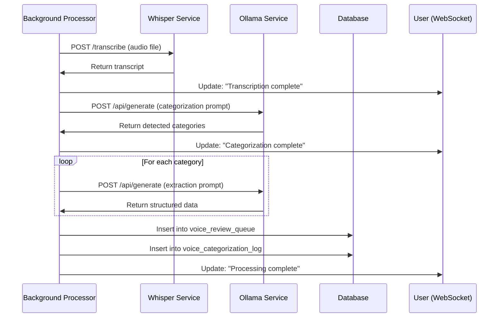
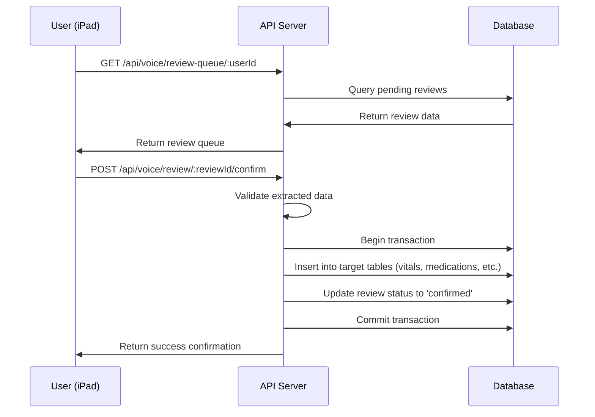

# Voice Categorization Service Architecture

## System Overview

The Voice Categorization system is a distributed architecture that processes voice recordings through multiple AI services to extract structured medical data. The system is designed for offline-first operation with high availability and fault tolerance.

## Architecture Diagram

```
┌─────────────────┐    ┌─────────────────┐    ┌─────────────────┐
│   iPad App      │    │  Admin Portal   │    │  External APIs  │
│  (React Native) │    │    (React)      │    │   (Future)      │
└─────────┬───────┘    └─────────┬───────┘    └─────────┬───────┘
          │                      │                      │
          └──────────────────────┼──────────────────────┘
                                 │
                    ┌─────────────┴─────────────┐
                    │     Load Balancer         │
                    │      (nginx)              │
                    └─────────────┬─────────────┘
                                 │
                    ┌─────────────┴─────────────┐
                    │   Backend API Server      │
                    │    (Node.js/Express)      │
                    │                           │
                    │  ┌─────────────────────┐  │
                    │  │  Voice Routes       │  │
                    │  │  Review Routes      │  │
                    │  │  WebSocket Server   │  │
                    │  └─────────────────────┘  │
                    └─────────────┬─────────────┘
                                 │
        ┌────────────────────────┼────────────────────────┐
        │                       │                        │
┌───────┴────────┐    ┌─────────┴─────────┐    ┌─────────┴─────────┐
│   PostgreSQL   │    │  Background       │    │   File Storage    │
│   Database     │    │  Processor        │    │   (Encrypted)     │
│                │    │                   │    │                   │
│ ┌────────────┐ │    │ ┌───────────────┐ │    │ ┌───────────────┐ │
│ │ Voice      │ │    │ │ Processing    │ │    │ │ Voice Files   │ │
│ │ Reviews    │ │    │ │ Queue         │ │    │ │ (.m4a, .wav)  │ │
│ │            │ │    │ │               │ │    │ │               │ │
│ │ Audit Logs │ │    │ │ Job Scheduler │ │    │ │ Temp Files    │ │
│ └────────────┘ │    │ └───────────────┘ │    │ └───────────────┘ │
└────────────────┘    └─────────┬─────────┘    └───────────────────┘
                               │
                    ┌──────────┴──────────┐
                    │                     │
            ┌───────┴────────┐    ┌───────┴────────┐
            │   Whisper      │    │    Ollama      │
            │   Service      │    │   Service      │
            │                │    │                │
            │ ┌────────────┐ │    │ ┌────────────┐ │
            │ │ faster-    │ │    │ │ Llama 3.1  │ │
            │ │ whisper    │ │    │ │ 8B Model   │ │
            │ │            │ │    │ │            │ │
            │ │ large-v3   │ │    │ │ Medical    │ │
            │ │ model      │ │    │ │ Prompts    │ │
            │ └────────────┘ │    │ └────────────┘ │
            └────────────────┘    └────────────────┘
```

## Component Details

### Frontend Layer

#### iPad App (React Native/Expo)
- **Purpose**: Primary clinical interface for voice recording and review
- **Key Features**:
  - Voice recording with context detection
  - Review queue management
  - Real-time processing notifications
  - Offline-first data synchronization
- **Technologies**: React Native 0.76.5, Expo ~52.0.0, Zustand, Socket.IO client

#### Admin Portal (React/Vite)
- **Purpose**: Administrative interface for system monitoring
- **Key Features**:
  - Voice processing analytics
  - User activity monitoring
  - System health dashboards
- **Technologies**: React 18.2, Vite 4.5, Material-UI

### Backend Layer

#### API Server (Node.js/Express)
- **Purpose**: Central API gateway and business logic coordinator
- **Key Responsibilities**:
  - Authentication and authorization
  - File upload handling and validation
  - Review queue management
  - Real-time WebSocket communication
  - Database operations coordination

**Key Services:**
```javascript
// Core services structure
src/services/
├── categorizationService.js    // AI categorization logic
├── reviewQueueService.js       // Queue management
├── voiceProcessing.js         // Processing coordination
├── backgroundProcessor.js     // Async job processing
├── ollamaService.js          // Ollama API client
├── whisperLocal.js           // Whisper API client
└── auditLog.js               // Audit trail logging
```

#### Background Processor
- **Purpose**: Handles asynchronous voice processing jobs
- **Architecture**: Event-driven job queue with worker processes
- **Features**:
  - Concurrent processing (max 4 jobs)
  - Priority queuing (urgent items first)
  - Retry logic with exponential backoff
  - Progress tracking and notifications

### AI Services Layer

#### Whisper Service (Speech-to-Text)
- **Model**: faster-whisper large-v3
- **Languages**: Japanese (primary), English, Traditional Chinese
- **Performance**: ~0.5x recording duration processing time
- **API**: HTTP REST interface on port 8080
- **Configuration**:
  ```python
  # whisper-api.py configuration
  model_size = "large-v3"
  language = "ja"  # Auto-detect enabled
  temperature = 0.0  # Deterministic output
  ```

#### Ollama Service (Data Extraction)
- **Model**: Llama 3.1 8B
- **Purpose**: Category detection and structured data extraction
- **Performance**: 20-30 seconds per analysis
- **Configuration**:
  ```json
  {
    "model": "llama3.1:8b",
    "num_ctx": 2048,
    "temperature": 0.1,
    "num_thread": 8
  }
  ```

### Data Layer

#### PostgreSQL Database
- **Version**: PostgreSQL 15
- **Key Tables**:
  - `voice_review_queue` - Pending reviews
  - `voice_categorization_log` - Audit trail
  - `voice_recordings` - Recording metadata
- **Features**:
  - JSONB for flexible data structures
  - Full-text search capabilities
  - Automated backup and archival

#### File Storage
- **Location**: Local filesystem with encryption
- **Structure**:
  ```
  uploads/voice/
  ├── [uuid]-[timestamp].m4a.enc  # Encrypted audio files
  └── temp/                       # Temporary processing files
  ```
- **Security**: AES-256 encryption at rest

## Data Flow

### 1. Voice Recording Flow



### 2. AI Processing Flow



### 3. Review and Confirmation Flow



## Scalability Considerations

### Horizontal Scaling

#### API Server Scaling
- **Load Balancing**: nginx with round-robin distribution
- **Session Management**: Stateless JWT tokens
- **File Upload**: Direct to shared storage
- **WebSocket**: Sticky sessions or Redis adapter

#### AI Service Scaling
- **Whisper**: Multiple instances behind load balancer
- **Ollama**: Model replication across multiple GPUs
- **Queue Distribution**: Redis-based job queue for multiple workers

### Vertical Scaling

#### Resource Requirements
```yaml
# Minimum production requirements
API Server:
  CPU: 4 cores
  RAM: 8GB
  Storage: 100GB SSD

Whisper Service:
  CPU: 8 cores
  RAM: 16GB
  GPU: Optional (CUDA support)

Ollama Service:
  CPU: 8 cores
  RAM: 32GB
  GPU: 24GB VRAM (recommended)

Database:
  CPU: 4 cores
  RAM: 16GB
  Storage: 500GB SSD
```

### Performance Optimization

#### Caching Strategy
```javascript
// Multi-level caching
const cacheStrategy = {
  // Level 1: In-memory (Node.js)
  transcriptionCache: new Map(), // 1 hour TTL
  modelCache: new Map(),         // Persistent
  
  // Level 2: Redis (shared)
  reviewQueueCache: 'redis',     // 5 minutes TTL
  userSessionCache: 'redis',     // 24 hours TTL
  
  // Level 3: Database query optimization
  indexStrategy: [
    'user_id + status',
    'created_at DESC',
    'JSONB GIN on extracted_data'
  ]
};
```

#### Database Optimization
- **Connection Pooling**: Max 20 connections
- **Query Optimization**: Prepared statements and indexes
- **Partitioning**: Time-based partitioning for large tables
- **Archival**: Automated cleanup of old records

## Security Architecture

### Authentication and Authorization

```javascript
// JWT-based authentication
const authFlow = {
  login: 'POST /api/auth/login → JWT token',
  validation: 'Middleware validates JWT on each request',
  permissions: 'Role-based access control (RBAC)',
  expiration: '24 hours with refresh token'
};
```

### Data Protection

#### Encryption at Rest
- **Voice Files**: AES-256 encryption with user-specific keys
- **Database**: Transparent Data Encryption (TDE)
- **Backups**: Encrypted backup files

#### Encryption in Transit
- **API Communication**: TLS 1.3
- **WebSocket**: WSS (WebSocket Secure)
- **Internal Services**: mTLS for service-to-service

### Access Control

#### Network Security
```yaml
# Firewall rules
Ingress:
  - Port 443 (HTTPS): Public access
  - Port 80 (HTTP): Redirect to HTTPS
  - Port 22 (SSH): Admin access only

Internal:
  - API ↔ Database: Port 5432
  - API ↔ Whisper: Port 8080
  - API ↔ Ollama: Port 11434
  - WebSocket: Port 3000
```

#### Data Access Control
- **User Isolation**: Users can only access their own reviews
- **Patient Context**: Validated against user permissions
- **Audit Logging**: All data access logged with timestamps

## Monitoring and Observability

### Health Checks

```javascript
// Health check endpoints
const healthChecks = {
  '/health': 'Basic API health',
  '/health/database': 'Database connectivity',
  '/health/ai-services': 'Whisper + Ollama status',
  '/health/storage': 'File system health',
  '/health/detailed': 'Comprehensive system status'
};
```

### Metrics Collection

#### Application Metrics
- **Processing Times**: Transcription, categorization, extraction
- **Queue Metrics**: Length, processing rate, error rate
- **User Activity**: Recordings per user, review completion rate
- **AI Performance**: Confidence scores, accuracy metrics

#### System Metrics
- **Resource Usage**: CPU, memory, disk, network
- **Database Performance**: Query times, connection pool usage
- **Error Rates**: HTTP errors, processing failures
- **Availability**: Uptime, service health

### Logging Strategy

```javascript
// Structured logging with different levels
const logLevels = {
  ERROR: 'System errors, processing failures',
  WARN: 'Performance issues, low confidence scores',
  INFO: 'User actions, processing completion',
  DEBUG: 'Detailed processing steps (dev only)'
};

// Log aggregation
const logDestinations = {
  console: 'Development environment',
  file: 'Production logs with rotation',
  database: 'Audit trail for compliance',
  external: 'Future: ELK stack or similar'
};
```

## Disaster Recovery

### Backup Strategy

#### Database Backups
- **Frequency**: Daily full backup, hourly incremental
- **Retention**: 30 days local, 1 year offsite
- **Testing**: Monthly restore testing
- **Encryption**: All backups encrypted

#### File Backups
- **Voice Files**: Replicated to secondary storage
- **Configuration**: Version controlled in Git
- **Secrets**: Encrypted backup of environment variables

### Recovery Procedures

#### Service Recovery
1. **API Server**: Auto-restart with health checks
2. **AI Services**: Graceful degradation, queue preservation
3. **Database**: Point-in-time recovery capability
4. **File Storage**: Redundant storage with checksums

#### Data Recovery
```sql
-- Example recovery procedures
-- Restore from backup
pg_restore --clean --if-exists -d verbumcare_demo backup.sql

-- Verify data integrity
SELECT COUNT(*) FROM voice_review_queue WHERE status = 'pending';

-- Resume processing
UPDATE voice_recordings SET review_status = 'pending_review' 
WHERE review_status = 'processing';
```

---

*For deployment instructions and operational procedures, see the Deployment Guide and Operations Manual.*